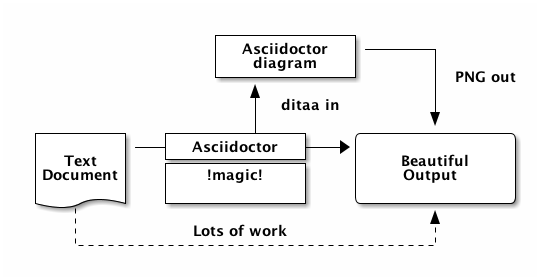
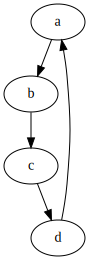
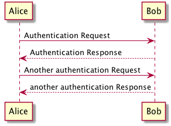
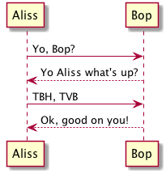

Using Asciidoctor Diagram in Maven projects
====

This is an example of how to use [Asciidoctor Diagram](https://asciidoctor.org/docs/asciidoctor-diagram/) to
generate diagrams in Maven projects and include them
in README and other Markdown files. It is based on the
[asciidoctor-maven-examples](https://github.com/asciidoctor/asciidoctor-maven-examples/tree/master/asciidoctor-diagram-example)

Asciidoctor Diagram is a set of Asciidoctor extensions
that support generating diagrams from multiple diagram
languages including AsciiToSVG, BlockDiag (BlockDiag, SeqDiag, ActDiag, NwDiag), Ditaa, Erd, GraphViz, Mermaid, Msc, PlantUML, Shaape, SvgBob, Syntrax, UMLet, Vega, Vega-Lite and WaveDrom. See [their website](https://asciidoctor.org/docs/asciidoctor-diagram/) website
for more details.

We might include this plugin configuration in the Sling Parent POM if we start using it in several
modules.

In this example project, the Asciidoctor Maven Plugin runs on every build as the corresponding `diagrams`
Maven profile is enabled by default. Depending on the diagram generators used, running the plugin might
change the generated images every time, which is not convenient.

Usage scenario
----

The idea is to store the diagrams under `src/docs/asciidoc` and have the [Asciidoctor Maven Plugin](https://asciidoctor.org/docs/asciidoctor-maven-plugin/) convert them and store the results under `src/docs/generated-diagrams`, so the generated images can be committed to be used in README and other
Markdown files.

Here are example diagrams generated by the asciidoc documents found under `src/docs/asciidoc`
in this project.

Note that some extensions require installing specific binaries, like Graphviz in this example. Others
are built-in and require nothing from the environment besides a standard Maven setup.

### ditaa diagram

### GraphViz diagram
This one requires the `dot` command of Graphviz to be available at build time.

If it is missing you probably got the following error at build time:

    asciidoctor: ERROR: more-diagrams.adoc: line 2: Failed to generate image: 
    Could not find the 'dot' executable in PATH; add it to the PATH or specify
    its location using the 'graphvizdot' document attribute

See the pom for how to change the location of the `dot` executable, if needed.    

### PlantUML diagram

### PlantUML diagram from a different source file

