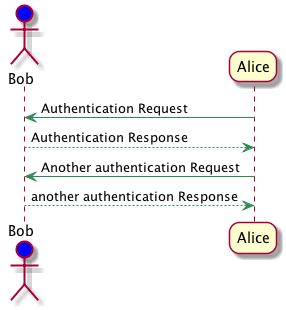

Using Asciidoctor Diagram in Maven projects
====

This is an example of how to use [Asciidoctor Diagram](https://asciidoctor.org/docs/asciidoctor-diagram/) to
generate diagrams in Maven projects and include them
in README and other Markdown files. It is based on the
[asciidoctor-maven-examples](https://github.com/asciidoctor/asciidoctor-maven-examples/tree/master/asciidoctor-diagram-example)

Asciidoctor Diagram is a set of Asciidoctor extensions
that support generating diagrams from multiple diagram
languages including AsciiToSVG, BlockDiag (BlockDiag, SeqDiag, ActDiag, NwDiag), Ditaa, Erd, GraphViz, Mermaid, Msc, PlantUML, Shaape, SvgBob, Syntrax, UMLet, Vega, Vega-Lite and WaveDrom. 

See [their website](https://asciidoctor.org/docs/asciidoctor-diagram/) website
for more details. Many of these tools do not work out of the box and must be installed
separately to be available at build time, but a few them are available out of the box, see 
below.

We might include this plugin configuration in the Sling Parent POM if we start using it in several
modules.

In this example project, the Asciidoctor Maven Plugin runs on every build as the corresponding `diagrams`
Maven profile is enabled by default. Depending on the diagram generators used, running the plugin might
change the generated images every time, which is not convenient.

Usage scenario
----

The idea is to store the diagrams under `src/docs/asciidoc` and have the [Asciidoctor Maven Plugin](https://asciidoctor.org/docs/asciidoctor-maven-plugin/) convert them and store the results under `src/docs/generated-diagrams`, so the generated images can be committed to be used in README and other
Markdown files.

Here are example diagrams generated by the asciidoc documents found under `src/docs/asciidoc`
in this project.

### Out-of-the box tools

The following diagram generation tools should work on a standard Maven setup.

#### ditaa diagram

#### PlantUML diagram

#### PlantUML diagram from a different source file

### Tools that must be installed separately

The following diagram generation tools must be installed separately to be available
at build time. If they are missing, the Maven plugin outputs descriptive
error messages but does not fail the build.

The `more-syntaxes.adoc` document has more examples in various syntaxes,
most or all fail to build unless you have installed the required tools.

#### GraphViz diagram
This one requires the `dot` command of [Graphviz](https://graphviz.org/)
to be available at build time.

   
#### Vega diagram

[Vega](https://vega.github.io) can be installed with `npm install -g vega-cli` so
that might be a reasonable option if we need more complex diagrams.

