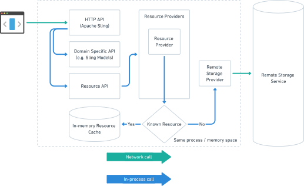

Apache Sling Remote Resource Provider
====

The Apache Sling Remote Resource Provider module provides an API for exposing resources from remote storage systems like
Dropbox, Box, One Drive, etc. into the Sling resource tree. For each active `RemoteStorageProvider` service, this module
will register a `ResourceProvider` and expose the remote resources as resources in the Sling tree.

The following high-level architecture describes the way a `RemoteStorageProvider` is integrated into a Sling instance:

For more details check the JavaDocs and the unit tests provided in this module.
