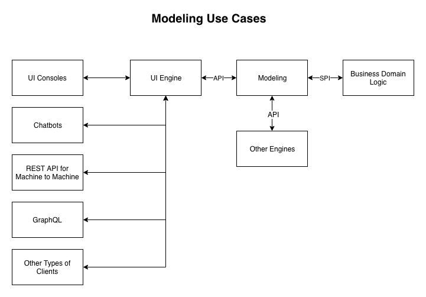

# Sling Modeling Framework

## Status of This Document

Editor’s Draft

## Introduction

Sling is a web framework that is backed by the content tree.
In Sling's vocabulary, each tree node is a *resource*.

*Uniform interface* is a powerful concept that is used in many places in Sling. REST—the primary architecture of Sling—has it as one of the constraints. JCR—the primary persistence layer of Sling—is a tree data structure, which again is a uniform interface. Sling's resource in turn is a uniform interface.

A resource has a type, and is usually called as *resource type*.
The resource types are the corner stone concept where many mechanics in Sling are driven by them.
For example, during HTTP request processing, they are used as the hooking mechanic between the requested resources and their renderers.

However, while there is a concept of resource types, Sling doesn't have the concept of resource type definitions.

When the developers develop using Sling, actually they have resource type definitions, but they are mostly reasoned in the minds of the developers and coded arbitrarily all over the place. Thus, we can say that while the definitions exist, they are implicit and informal.

The lack of formal resource type definitions can be summarized with the problem where we cannot do *reflection* and *meta programming*. And this is a missed opportunity because we cannot leverage uniform interface to the fullest.

The act of defining the type system and using it to drive subsequent domain features is crudely defined as the act of modeling. Therefore, the primary objective of Sling Modeling Framework is to establish the concept and infrastructure to do modeling in Sling.

## Introduction to Models

[Models](../model/src/main/java/org/apache/sling/modeling/Models.java) is a set of models that are applicable to a particular object.

Since resource is the main working object in Sling, most likely it is the primary target of modeling.

To get the Models from a resource, simply perform an adaptation to `Models.class`:

```java
Resource resource = slingRequest.getResource();
Models models = resource.adaptTo(Models.class);
```

And once the Models object is obtained, it can be used to perform reflection on the resource.

### Alternative Way Getting the Models

(Note that this approach is not implemented by this POC)

Instead of adapting to `Models.class`, ideally we can enhance the [Adaptable](https://static.javadoc.io/org.apache.sling/org.apache.sling.api/2.20.0/org/apache/sling/api/adapter/Adaptable.html) to allow its client to do reflection on the available adapters:

```java
public interface Adaptable {

    // ... existing methods ...

    @NotNull
    Collection<@NotNull Class<?>> getAvailableAdapters();
}
```

Then use it like the following:

```java
Resource resource = slingRequest.getResource();
Collection<@NotNull Class<?>> adapters = resource.getAvailableAdapters();

for (Class<?> clazz : adapters) {
    resource.adaptTo(clazz);
}
```

## Introducing DataModel

[DataModel](../src/main/java/org/apache/sling/modeling/data/DataModel.java) is the lowest level model that describes a resource from the perspective of data.

For example, given the following resource:

```
+ mycontent
  - jcr:created = "2018-03-06T11:03:28.879+08:00"
  - jcr:createdBy = "admin"
  - jcr:language = "en_US"
  - jcr:title = "Example Page"
  - sling:resourceType = "example/components/page"
```

A DataModel can be created for `/libs/example/components/page` resource type to describe its data type:

(Note that the model is described using JSON format for the purpose of this article)

```json
{
    "properties": [{
        "sling:id": "created",
        "sling:name": "jcr:created",
        "sling:type": "sling:date",
        "sling:title": "Created Date"
    }, {
        "sling:id": "createdby",
        "sling:name": "jcr:createdBy",
        "sling:type": "sling:user",
        "sling:title": "Created By"
    }, {
        "sling:id": "language",
        "sling:name": "jcr:language",
        "sling:type": "sling:locale",
        "sling:title": "Language"
    }, {
        "sling:id": "title",
        "sling:name": "jcr:title",
        "sling:type": "sling:text",
        "sling:title": "Title",
        "sling:required": true
    }, {
        "sling:id": "resourcetype",
        "sling:name": "sling:resourceType",
        "sling:type": "sling:resourcetype",
        "sling:title": "Resource Type"
    }]
}
```

When describing the DataModel of `/libs/example/components/page` this way, we are essentially saying that we model the content structure of `/libs/example/components/page`. The resources having `/libs/example/components/page` as their resource types are driven by its models, where DataModel is one of many possible models.

To get the DataModel of a resource, simply adapt the resource into `DataModel.class`:

```java
Resource resource = slingRequest.getResource();
DataModel dataModel = resource.adaptTo(DataModel.class);
// use dataModel accordingly
```

### DataModel's Properties

A DataModel consists of multiple [Properties](../src/main/java/org/apache/sling/modeling/data/Property.java).

A Property represents the definition of a resource's property.
The definition is typically just a set of attributes describing the characteristics of the said property.

### Property Types

The most important attribute is `sling:type` attribute, which represents the type of the property.

Just like resource types are often used as a hooking mechanic to model the resources,
the property types are also used as a hooking mechanic to model the properties.

For instance, Sling provides [sling:text](../src/main/java/org/apache/sling/modeling/data/commons/impl/TextPropertyImpl.java) type to represent a simple text property. It defines the following attributes:

* `sling:id`
* `sling:name`
* `sling:type`
* `sling:title`
* `sling:multiple`
* `sling:readonly`
* `sling:required`
* `sling:validations`

The app developers can then use these attributes to describe their properties.

Using the example above, the `jcr:title` property has the following definition:

```
sling:id = "title"
sling:name = "jcr:title"
sling:type = "sling:text"
sling:title = "Title"
sling:required = true
```

Besides `sling:text`, Sling will provide out-of-the-box types, such as textarea, date, number, boolean, and path.

### PropertyHandler

Each property type needs to implement a [PropertyHandler](../src/main/java/org/apache/sling/modeling/data/spi/PropertyHandler.java).

The primary purpose of the handler is to be the implementation to retrieve/persist the property's values from/to the persistence layer.
It is implemented as an OSGi service.

### Comparison with ValueMap

Traditionally, when dealing with resource's properties, ValueMap is used:

```java
ValueMap vm = resource.getValueMap();
String prop1 = vm.get("prop1", String.class);
```

ValueMap offers conversion service to convert the properties to the desired Java classes.
However, it only covers the "primitive" types, such as String, Long, Calendar, and their collection counterparts.
It is not extensible to cover more complex property types, such as path, URI, and JSON.
ValueMap decision may be based on the types supported by the persistence layer, which is JCR in general.

DataModel is simply ValueMap on steroid, where it allows arbitrary property types to be defined.

PropertyHandler is used as the converter between the DataModel's Property and the persistence layer.
So, while the persistence layer only allows a certain set of primitive types,
we can simply define a new property type to represent a more complex type and implement its PropertyHandler to convert between the Java class and the persistence layer's type, which would be a simple String most likely.

### Establishing the DataModels

To establish the DataModels, app developers need to implement and register [PropertyProviders](../src/main/java/org/apache/sling/modeling/data/spi/PropertyProvider.java),
where the app developers need to associate them with the resource types using OSGi service property.

For example for `/libs/example/components/page` resource type:

```java
@Component(
    property = {
        PropertyProvider.PROPERTY_RESOURCE_TYPE + "=/libs/example/components/page"
    }
)
public class PagePropertyProvider implements PropertyProvider {
    @Override
    @NotNull
    public List<@NotNull Property> getProperties() {
        // Return the list of properties
    }
}
```

### Data Modeling Using JCR Node Types

While the resource types are the most common ways to define the types of the resources,
the typing system of the underlying platform is richer than just resource types alone.
Since JCR is the primary persistence layer of Sling, JCR's node types can be considered as a typing system as well.

The following example shows a content structure using `cq:Page` and `cq:PageContent` node types of AEM:

```
+ /content/we-retail
  - jcr:created = "2018-11-27T15:12:53.516+08:00"
  - jcr:createdBy = "admin"
  - jcr:primaryType = "cq:Page"
  + jcr:content
    - cq:allowedTemplates = ["/conf/we-retail/settings/wcm/templates/.*"]
    - cq:lastModified = "2016-02-09T00:05:48.520+01:00"
    - cq:lastModifiedBy = "admin"
    - jcr:created = "2018-11-27T15:14:41.552+08:00"
    - jcr:createdBy = "admin"
    - jcr:primaryType = "cq:PageContent"
    - jcr:title = "We.Retail"
    - sling:resourceType = "weretail/components/structure/page"
```

Unlike Sling, JCR has node type definition. Here is the definition of `cq:PageContent`:

```
[cq:PageContent] > cq:OwnerTaggable, cq:ReplicationStatus, mix:created, mix:title, nt:unstructured, sling:Resource, sling:VanityPath
  orderable
  - cq:lastModified (date)
  - cq:template (string)
  - pageTitle (string)
  - offTime (date)
  - hideInNav (boolean)
  - cq:lastModifiedBy (string)
  - onTime (date)
  - jcr:language (string)
  - cq:allowedTemplates (string) multiple
  - cq:designPath (string)
  - navTitle (string)
```

In addition to Sling's resource type, Sling Modeling Framework allows to model the DataModel based on JCR node types as well.
This is done by also implementing and registering PropertyProvider with the appropriate OSGi service property.

For example for `cq:PageContent` primary node type:

```java
@Component(
    property = {
        PropertyProvider.PROPERTY_NODE_TYPE + "=cq:PageContent"
    }
)
public class PageContentPropertyProvider implements PropertyProvider {
    @Override
    @NotNull
    public List<@NotNull Property> getProperties() {
        // Return the list of properties for `cq:lastModified`, `cq:template`, `pageTitle`, etc
    }
}
```

For example for `mix:created` mixin node type:

```java
@Component(
    property = {
        PropertyProvider.PROPERTY_NODE_TYPE + "=mix:created"
    }
)
public class CreatedPropertyProvider implements PropertyProvider {
    @Override
    @NotNull
    public List<@NotNull Property> getProperties() {
        // Return the list of properties for `jcr:created`, `jcr:createdBy`
    }
}
```

### Data Modeling Using Marker Resources and Properties

Content modelers often use marker resources and properties to associate the resources with certain concepts.

For example, a module may use `example:cartPage` property to indicate integration with the existing page resource:

```
+ /content/we-retail/language-masters/en/jcr:content
  - example:cartPage = "/content/we-retail/language-masters/en/user/cart"
  - jcr:primaryType = "cq:PageContent"
  - jcr:title = "English"
  - sling:resourceType = "weretail/components/structure/page"
```

So here `example:cartPage` acts as the marker property to establish typing for that module.

Likewise, the following uses `example:config` subresource as the marker:

```
+ mycontent
  - sling:resourceType = "example/components/page"
  + example:config
    - prop1 = "value1"
```

PropertyProvider can then be implemented and registered with the appropriate OSGi service property:

```java
@Component(
    property = {
        PropertyProvider.PROPERTY_MARKER_PROPERTY + "=example:cartPage"
    }
)
public class CartPagePropertyProvider implements PropertyProvider {
    @Override
    @NotNull
    public List<@NotNull Property> getProperties() {
        // Return the list of properties for `example:cartPage`
    }
}

@Component(
    property = {
        PropertyProvider.PROPERTY_MARKER_RESOURCE + "=example:config"
    }
)
public class ConfigPropertyProvider implements PropertyProvider {
    @Override
    @NotNull
    public List<@NotNull Property> getProperties() {
        // Return the list of the relevant properties for `example:config`
    }
}
```

### Modeling the Underlying Platform's Typing System

By establishing the DataModel this way, we are essentially saying that we model the typing system of the underlying platform. Then the models are used to drive the resources and other parts of the application.

For example, if we have the following DataModel definitions:

* `/libs/example/components/page` resource type having `prop1` and `prop2` properties
* `mix:created` node type having `jcr:created` and `jcr:createdBy` properties

Then when we have the following resource:

```
+ myresource
  - sling:resourceType = "/libs/example/components/page"
  - jcr:mixinTypes = ["mix:created"]
  - prop1 = "value1"
  - prop2 = "value2"
  - jcr:created = "2018-03-06T11:03:28.879+08:00"
  - jcr:createdBy = "admin"
```

The DataModel of the resource will have `prop1`, `prop2`, `jcr:created`, and `jcr:createdBy` properties.
The resource itself is also allowed to have those properties as defined by the DataModel.

### Next Steps for DataModel

* Tutorial on how to create a new property type named `example:json`
* Java Annotations to Define Models
* Automatic Index Management
* Automatic DataModel Creation Based on JCR Node Type Definitions

## Other Models

Once the concept of modeling is understood, there are many opportunities that can be solved by simply defining models.

These are other known models that can be defined:

1. FormModel
   * Describes the form definition of a resource.
   * It makes use of the DataModel for the data types of the fields.
2. ActionsModel
   * Describes the applicable actions that can be performed on a resource.
   * e.g. edit action, delete action, move action, and publish action.
3. CollectionModel
   * The API dealing with the collection pattern of a resource.
   * e.g. Getting the children, which supports filtering, sorting, pagination features.
4. Console
   * The API dealing with an instance of a console, such as title, description, icon.
   * This will be useful also for sitemap/global navigation.
5. Card
   * The API dealing with the metadata to be displayed in the card.
6. Tabular
   * The API dealing with the metadata to be displayed in the tabular format.
7. Search
   * The API exposing search functionality of the content resource.
   * This is related to the FormModel.
8. Preferences
   * The API exposing the preferences of the current user.
   * This is related to the FormModel.

## Why Modeling

So far many of the efforts done in Sling are focused on the backends, while there is litte fundamental improvements done to support the development of the response to the clients.

Sling offers a default JSON servlet—which is just a mere content dump as JSON—and a default POST servlet—which again a content dump in the reverse direction from the clients to the server, and they are used a lot, often as best practice, or even marketed (wrongly) as RESTful.

Both servlets are inadequate, error prone, and unmanageable, creating coupling between the clients and the server's persistence layer.
More importantly, since they are not RESTful, we don't get the desired benefits of RESTful system.
Meanwhile, there is a great need for standardization, consistency, and fast iteration to develop UI or other client apps. Therefore, there is a need for alternative approach besides them.

With modeling, we can put structures to manage the application code—what to put where—such that software best practices are more easily enforced.
The following diagram is an example of the arrangement that we can have once we have it:


