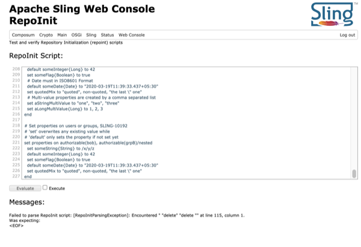

 

# Apache Sling RepoInit WebConsole

Test and run [Sling RepoInit](https://sling.apache.org/documentation/bundles/repository-initialization.html) scripts from the web console.

## Installation

Either download the latest version of this bundle from the [Sling Downloads page](https://sling.apache.org/downloads.cgi) or build from source by checking out the project from Git and building with Maven:

`mvn clean install sling:install`

Note installing from source requires Java 11 or later and Maven 3.x or later.

This project has been tested to work with Sling 11+.

## Use

To use the plugin, navigate to [/system/console/repoinit](http://localhost:8080/system/console/repoinit) and enter the script you want to run into the source text area. Select the `Evaluate` button to validate the script, if you want to execute the script, select the `Execute` checkbox.

Assuming the script is valid a JSON representation will be displayed in the `Parsed Statements` section and the corresponding Feature Model JSON will display in the `Feature Model JSON` section.

If your script is not valid, an error message will be displayed in the `Messages` section. 

