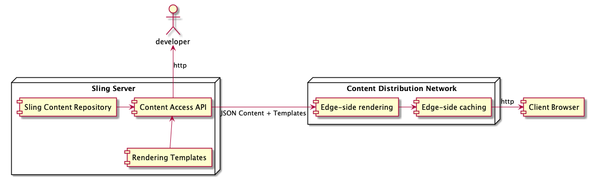

# Apache Sling Remote Content API

This is an _early days_ experiment to implement a document-oriented
Remote Content Access HTTP API for Sling content.

_Document-oriented_ means that the API exposes higher level objects than
Sling resources, typically documents which represent website pages and
similar content objects.

The API is meant to be fully discoverable, starting at the root should
be sufficient for you to discover all the content and how to use it.

It is meant to be friendly to both humans and machines, which is a challenge.
The well-defined scope of the API helps with that.

The API itself expose read-only content, but it includes links to 
a _command processor_ which will be implemented (separately, later)
to process content modifications and other commands. That processor
will use a CQRS-style Command Pattern,  where the read channel
represented by this API is distinct from the write channel (the 
Command Processor) and where things are not guaranteed to happen
synchronously.

## How to run this

Build and start this with

    mvn clean install exec:java

And open the root page at

    http://localhost:8080

After that...well, the API is supposed to be _discoverable_ so you should find your way!

To activate debugging, use the standard `MAVEN_OPTS` - the Java code is started
directly in the Maven process.

The `/content/articles` subtree is where the most interesting content is, for now.

## Use Cases

### Client-side rendering

For this use case, we want the API to be easy to consume both by the developers
who learn and discover it, and by client-side rendering code.

The client-side rendering code will usually not be provided by Sling for this use
case, but it could, using the mechanism described below for edge-side rendering.

### Edge-side rendering

For this use case we probably need to deliver both the content and the rendering templates
from Sling. We might use the current template resolution mechanism and include the URLs of
suggested templates, keyed by extension and selectors, with the content in order to simplify
the edge-side rendering code.

## Test Content

The test content uses `com.adobe.aem.guides:aem-guides-wknd.ui.content.sample` which is MIT
licensed. Minimal "fake" JCR nodetype definitions are used to allow this content to load, as
we don't really care about the details of these node types besides their names.