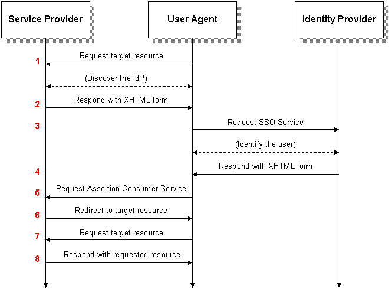

# Apache Sling SAML2 Handler

This project is intended to be a contribution to the [Apache Sling](https://sling.apache.org) project;
 it has a SAML2 Service Provider Authentication Handler and the associated SAML2 servlets and utilities.  

SP_POST_Request;_IdP_POST_Response
https://en.wikipedia.org/wiki/SAML_2.0#SP_POST_Request;_IdP_POST_Response

## This bundle 
- Will allow Sling applications to authenticate users against Identity Providers (idp) 
such as Shibboleth using SAML2 protocols. 
- Will sync of user management based on the SAML2 Assertion and OSGi bundle configs
  - Sync attributes from the IDP to the User as specified in the bundle OSGi configs
  - Create the user upon successful IDP authentication
  - Sync user membership of groups as defined in the OSGi configs
- Packages
  - `idp` is a test fixture based on the OpenSAML V3 eBook. It will be useful for minimizing 
  setup for testing purposes. Set to disabled for production.  
  - `sp` is the package for service provider classes, servlets and the 
  Sling authentication handler
  - `Helpers` static utilities for help using the opensaml library
    
 
This code is Derivative Works from [webprofile-ref-project-v3](https://bitbucket.org/srasmusson/webprofile-ref-project-v3)
* ArtifactResolutionServlet.java changed to be a Sling Servlet
* ConsumerServlet.java changed to be a Sling Servlet
* ConsumerServlet.java changed to be a Sling Servlet
* Renamed OpenSAMLUtils.java to Helpers.java
* [Apache License for webprofile-ref-project-v3](https://bitbucket.org/srasmusson/webprofile-ref-project-v3/src/master/LICENSE) 

