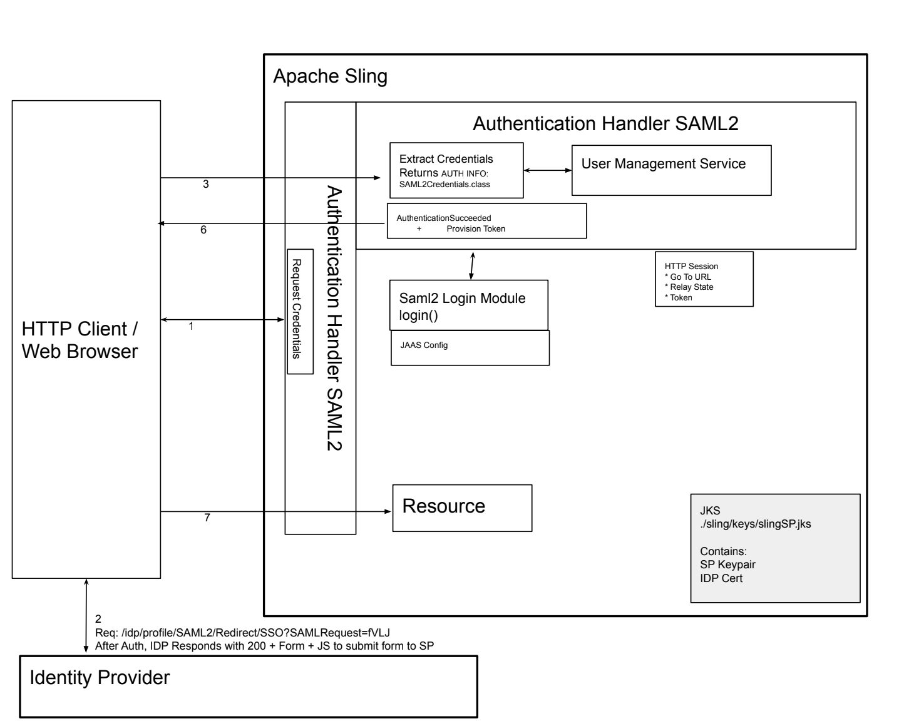
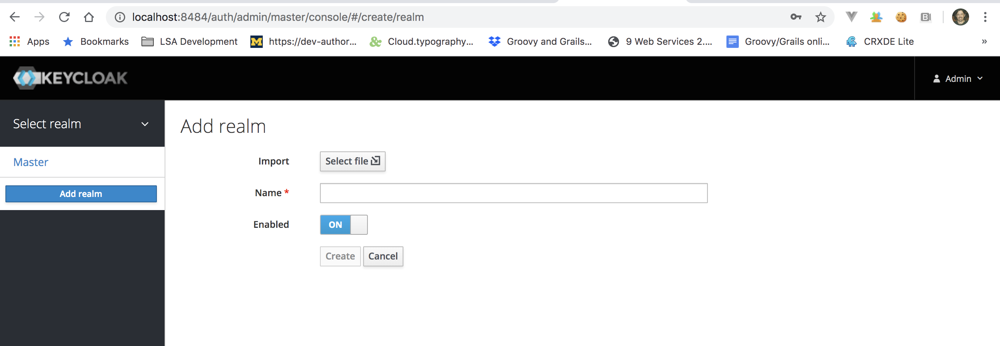
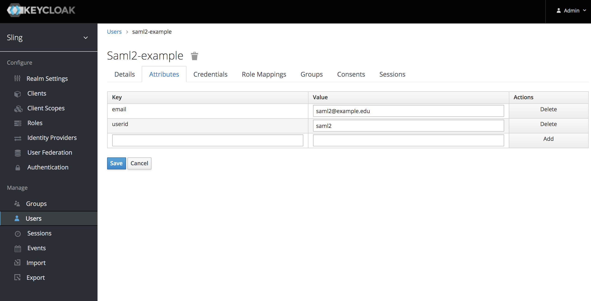
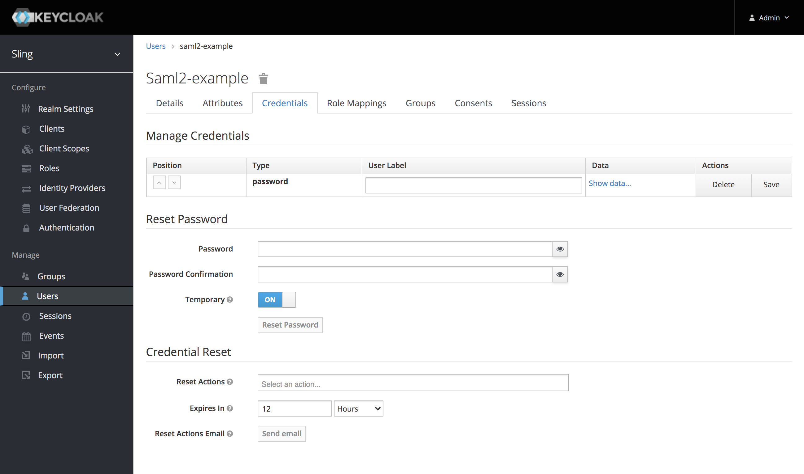
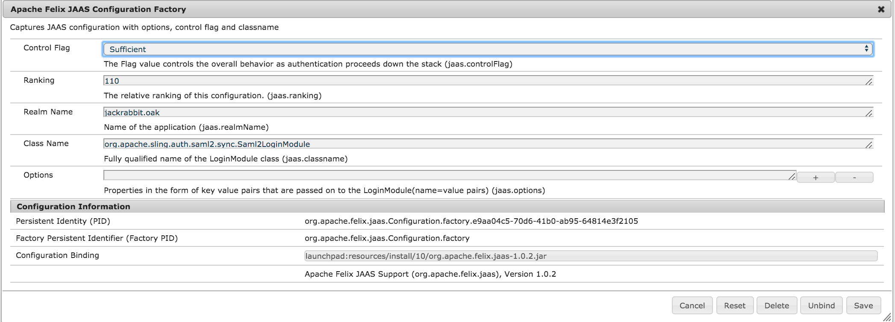
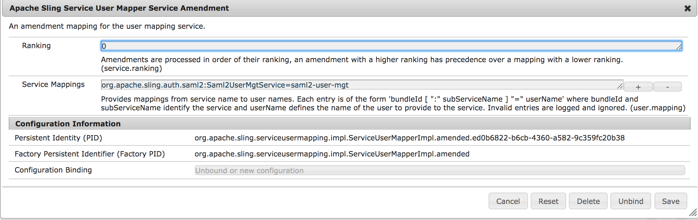
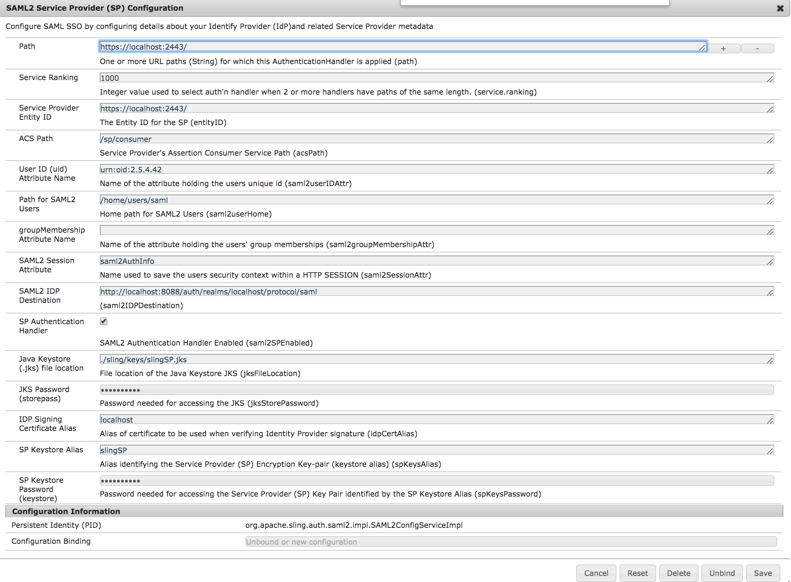
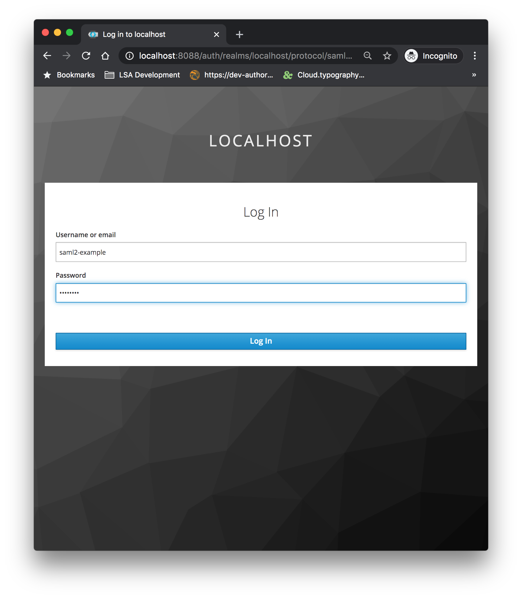
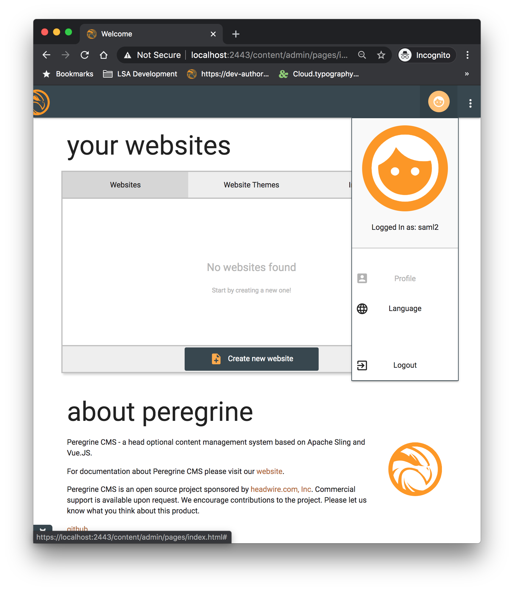
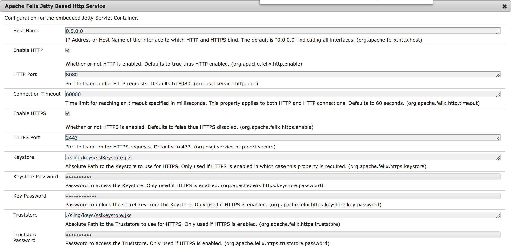

# Apache Sling SAML2 Handler (NOT FOR PRODUCTION)

This contribution to the [Apache Sling](https://sling.apache.org) project;
 provides a SAML2 Web Profile Service Provider Authentication. 

## Overview
https://en.wikipedia.org/wiki/SAML_2.0

* The SAMLRequest uses HTTP Redirect Binding, and the contained Authn Request object instructs the IDP to use HTTP Post Binding. 

   
Sling applications may authenticate users against an Identity Provider (idp) 
such as Keycloak Server or Shibboleth IDP.

### Requirements
- Java 11
- Sling 11 or 12
- The bundle will not activate without [org.apache.jackrabbit.oak-auth-external](https://mvnrepository.com/artifact/org.apache.jackrabbit/oak-auth-external)
- An external SAML2 identity provider

### User Management
User management is based on the OSGi bundle configuration and SAML2 Assertion    
  - Upon successful authentication, a user is created
  - The user may be added to a JCR group membership under certain conditions: 
    - An OSGI config is set `saml2groupMembershipAttr` with the value of the group membership attribute
    - The users' assertion contains an attribute where the key is value of `saml2groupMembershipAttr` and the attribute value is an existing JCR group.
   Note that if the assertion group membership attribute value contains values that are not existing JCR groups, then the value is ignored.   
  - Other user attributes from the assertion may be configured. This allows profile properties such as given name, family name, email, and phone which are leased by the Identity Provider and added to the JCR User's properties. Such attributes are configured by setting `syncAttrs` to the corresponding attribute keys.      
   

## Localhost Setup
Procedure for localhost testing

### Start and Configure an External Identity Provider 
1. Start a Keycloak Server 
`docker run -p 8484:8080 -e KEYCLOAK_USER=admin -e KEYCLOAK_PASSWORD=admin quay.io/keycloak/keycloak:10.0.2`
2. Login using http://localhost:8484/auth/admin/ 
   - username: admin, password: admin
3. Configure a Realm   
   - Click "Add Realm" 
   - Select the file located at `saml-handler/src/main/resources/sling-realm-export.json` 

Note. The preconfigured realm contains configuration for the client and the groups, but does not contain users.
4. Add user(s)
   - Select Users under the "Sling" Realm
         
   - Set user attributes
      
   - Set user password
      
   - Set user groups
        
   

### Sling SAML2 Service Provider Setup   

1. Start Sling
2. Use Felix "/system/console" to install bundle [org.apache.jackrabbit.oak-auth-external](https://mvnrepository.com/artifact/org.apache.jackrabbit/oak-auth-external) corresponding to the JCR Oak version in your instance (e.g. 1.26.0)
3. Run `mvn clean install -P autoInstallBundle` to the SAML2 Bundle. Verify the state is Active
4. Use Composum to install the localhost test package "src/main/resources/localhostExample-1.zip" 

#### Configurations, Service User and ACL's 
Note: the following are contained in localhostExample-1.zip

Provide a [JAAS OSGI Config](http://localhost:8080/system/console/configMgr/org.apache.felix.jaas.Configuration.factory) as shown below
- jaas.controlFlag=Sufficient  
- jaas.ranking=110  
- jaas.realmName=jackrabbit.oak  
- jaas.classname=org.apache.sling.auth.saml2.sp.Saml2LoginModule  

Provide a [Service User Mapper OSGI Config](http://localhost:8080/system/console/configMgr/org.apache.sling.serviceusermapping.impl.ServiceUserMapperImpl.amended)
- org.apache.sling.auth.saml2:Saml2UserMgtService=saml2-user-mgt

Set up the system user "saml2-user-mgt"
- visit [Composum Users](http://localhost:8080/bin/users.html) as admin
- Create service user "saml2-user-mgt"
- Provide an ACL rule for  granting `jcr:all` to this user on the `/home` path 

   
Provide a [SAML2 OSGI Configuration](http://localhost:8080/system/console/configMgr/org.apache.sling.auth.saml2.impl.SAML2ConfigServiceImpl) 
- path=http://localhost:8080/  
- service.ranking=1000  
- entityID=http://localhost:8080/  
- acsPath=/sp/consumer
- saml2userIDAttr=urn:oid:0.9.2342.19200300.100.1.1
- saml2userHome=/home/users/saml  
- saml2groupMembershipAttr=  
- saml2SessionAttr=saml2AuthInfo  
- saml2IDPDestination=http://localhost:8484/idp/profile/SAML2/Rediect/SSO   
- saml2SPEnabled=true   
- jksFileLocation=   
- jksStorePassword=   
- idpCertAlias=
- spKeysAlias=
- spKeysPassword=
   

Use [Composum Users](http://localhost:8080/bin/users.html) to create the group "pcms-authors" to test automatic group membership assignment

Notes:     
   - Users home "/home/users/saml" will be created once the first user successfully authenticates.    
   - After configuring the SAML2 authentication handler, the Sling Form login can still be accessed directly http://localhost:8080/system/sling/form/login?resource=%2F
   - See below technical notes for certificate, keys, signing and encryption   

## Test   
Visit http://localhost:8080 and observe login takes place on the http://localhost:8484 Keycloak Server IDP

Enter credentials for the user you created, and observe user is granted access to the system.

 
## Certificates, SSL, Signing and Encryption  
This portion discusses 

### Enable Jetty HTTPS
Just as Jetty requires a JKS to enable https, the SAML2 SP bundle requires a JKS to hold the IDP's signing certificate and to hold the SAML2 Service providers encryption key-pair. One suggestion is to locate these under the sling folder...
  
 `$ cd sling`   
 `$ mkdir keys`  
 `$ cd keys`
  

Create KeyStore & Generate Self Signed Cert (not for prod). While https on Jetty is technically not required, it serves a few purposes here: provides better security for direct access, and confirms the Java Keystore is configured properly and accessible by the sling system user. 
  
#### Make a JKS to hold a SSL (self-signed) Certificate 
 `$ keytool -genkeypair -keyalg RSA -validity 365 -alias sslstore -keystore sslKeystore.jks -keypass jettykeypass
-storepass  JKSPassord -dname "CN=localhost, OU=LSA Technology Services, O=University of Michigan,L=Ann Arbor, S=MI, C=US"`

Note: Make note of the JKS filename and path, storepass, keypass, and cert alias.  

#### Configure https on Jetty   
The following are based on the example sslKeystore contained under resources.  
org.apache.felix.https.enable=B"true"  
org.osgi.service.http.port.secure=I"443"  
org.apache.felix.https.keystore="./sling/keys/sslKeystore.jks"  
org.apache.felix.https.keystore.password="JKSPassord"  
org.apache.felix.https.keystore.key.password="jettykeypass" 
org.apache.felix.https.truststore.password="JKSPassord"     

Note: To use the example sslKeystore.jks, copy it to your Sling folder ./sling/keys/sslKeystore.jks  
After enabling Jetty to use https over port 2443, you will need to accept the browser security warning when accessing https://localhost:2443/ due to the use of a self-signed certificate.

     
### Put your Service Provider KeyPair into a JKS 
Option 1: Generate using Keytool  
`$ keytool -genkey -alias samlKeys -keyalg RSA -keystore samlKeystore.jks`  
Make note of the storepass, alias, filename, and key password.  
These will all be needed to configure SP encryption.  
The generated JKS should be imported into your Keycloak localhost Client "SAML Keys"

Option 2: Import Existing into jks  
`$ keytool -importkeystore -srckeystore serviceProviderKeys.p12 -destkeystore samlKeystore.jks
-srcstoretype pkcs12 -alias spKeysAlias`
 
 

### Put your Identity Provider's Signing Certificate into SAML JKS
Get the cert.pem from Realm Setting > Keys
Copy pem cert and paste into a text file

-----BEGIN CERTIFICATE-----   
MIICoTCCAYkCBgFxqKn5fjANBgkqhkiG9w0BAQsFADAUMRIwEAYDVQQDDAlsb2Nh   
bGhvc3QwHhcNMjAwNDIzMjAwOTAzWhcNMzAwNDIzMjAxMDQzWjAUMRIwEAYDVQQD   
....   
-----END CERTIFICATE-----
    
`$ keytool -import -file idp-signing.pem  -keystore samlKeystore.jks -alias IDPSigningAlias`

##

Licensed to the Apache Software Foundation (ASF) under one
or more contributor license agreements.  See the NOTICE file
distributed with this work for additional information
regarding copyright ownership.  The ASF licenses this file
to you under the Apache License, Version 2.0 (the
"License"); you may not use this file except in compliance
with the License.  You may obtain a copy of the License at
  http://www.apache.org/licenses/LICENSE-2.0
Unless required by applicable law or agreed to in writing,
software distributed under the License is distributed on an
"AS IS" BASIS, WITHOUT WARRANTIES OR CONDITIONS OF ANY
KIND, either express or implied.  See the License for the
specific language governing permissions and limitations
under the License.

This module was contributed to Apache Sling by Cris Rockwell and Regents of the University of Michigan.