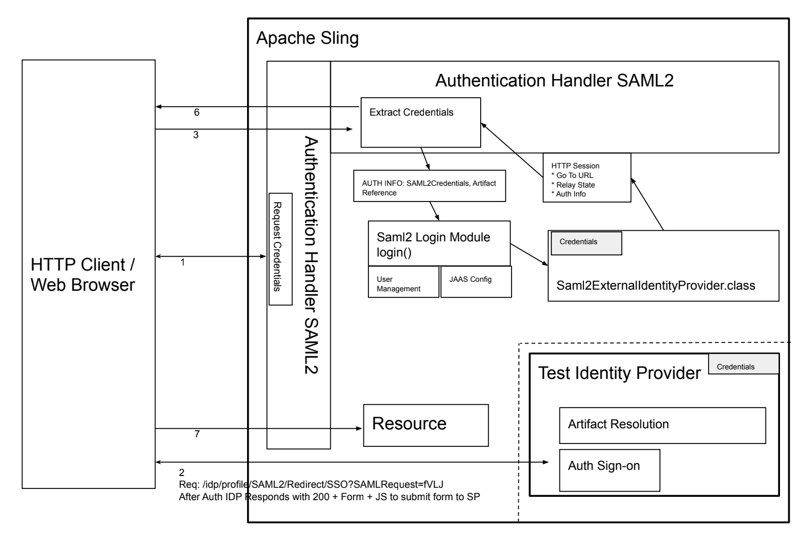

# Apache Sling SAML2 Handler (NOT FOR PRODUCTION)

This project is intended to be a contribution to the [Apache Sling](https://sling.apache.org) project;
 it has a SAML2 Service Provider Authentication Handler and the associated SAML2 servlets and utilities.  
It is a work in progress and not production ready!

SP_POST_Request;_IdP_POST_Response
https://en.wikipedia.org/wiki/SAML_2.0#SP_POST_Request;_IdP_POST_Response

## This bundle 
- Will allow Sling applications to authenticate users against Identity Providers (idp) 
such as Shibboleth using SAML2 protocols. 
- Will sync of user management based on the SAML2 Assertion and OSGi bundle configs
  - Sync attributes from the IDP to the User as specified in the bundle OSGi configs
  - Create the user upon successful IDP authentication
  - Sync user membership of groups as defined in the OSGi configs
- Packages
  - `idp` is a test fixture based on the OpenSAML V3 eBook. It will be useful for minimizing 
  setup for testing purposes. Set to disabled for production.  
  - `sp` is the package for service provider classes utilities
  - `Helpers` static utilities for help using the opensaml library
    
 
## Set up JKS  
 `$ cd sling`   
 `$ mkdir keys`  
 `$ cd keys`
  
 ### Create KeyStore & Generate Self Signed Cert (not for prod)
 While https on Jetty is technically not required, it serves a few purposes here: provides better security for direct access, and confirms the Java Keystore is configured properly and accessible by the sling system user. 
  
 #### Create self-signed SSL Certificate 
 `$ keytool -genkeypair -keyalg RSA -validity 365 -alias samlStore -keystore samlKeystore.jks -keypass key_password
-storepass  storepassword -dname "CN=localhost, OU=LSA Technology Services, O=University of Michigan,L=Ann Arbor, S=MI, C=US"`

Note: Make note of the JKS filename and path, storepass, keypass, and cert alias.  

#### Configure https on Jetty
org.apache.felix.https.enable=B"true"  
org.osgi.service.http.port.secure=I"443"  
org.apache.felix.https.keystore="./sling/keys/slingKeystore.jks"  
org.apache.felix.https.keystore.key.password="key_password" 
org.apache.felix.https.keystore.password="storepassword" 
org.apache.felix.https.truststore.password="storepassword"     
     
### Put your Service Provider KeyPair into the JKS 
Option 1: Generate using Keytool  
`$ keytool -genkey -alias samlKeys -keyalg RSA -keystore samlKeystore.jks`

Option 2: Import Existing into jks  
`$ keytool -importkeystore -srckeystore serviceProviderKeys.p12 -destkeystore theKeystore.jks
-srcstoretype pkcs12 -alias spKeysAlias`
 
### Put your Identity Provider's Signing Certificate into the JKS
`$ keytool -import -file idp-signing.pem  -keystore theKeystore.jks -alias IDPSigningAlias`